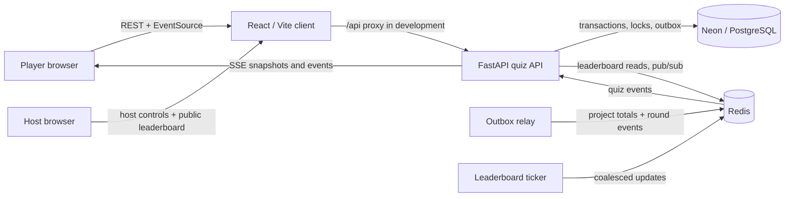

# Real-Time Vocabulary Quiz

A production-minded take-home implementation of a host-paced English vocabulary
quiz. Players join before the quiz begins, answer one shared question per
round, and see live leaderboard updates. A separate host workspace starts the
quiz, advances every player to the next question, and resets a demo run.

## Highlights

- Five seeded, one-question rounds with server-authoritative timing and scoring.
- FastAPI REST commands plus native browser Server-Sent Events (SSE).
- PostgreSQL is the durable source of truth; Redis is a rebuildable leaderboard
  projection and cross-process event fan-out layer.
- Transactional outbox prevents a committed score from being lost before it is
  projected and published.
- New participation is locked when the first question starts, preserving a fair
  leaderboard. Existing players can reconnect through their idempotency key.
- Host-only next-question and reset actions make repeated demos straightforward.

## Architecture



The FastAPI lifespan starts the outbox relay and leaderboard ticker. Command
handlers only commit durable state to PostgreSQL; workers project it to Redis
after commit. If Redis is unavailable, leaderboard reads fall back to
PostgreSQL.

## Repository layout

```text
api/              FastAPI service, Alembic migrations, tests, and load scenarios
web/              Bun-managed React demo client
```

See [api/README.md](api/README.md) for the full API contract and
[web/README.md](web/README.md) for client-specific details.

## Run locally

Prerequisites:

- Python 3.12 and [uv](https://docs.astral.sh/uv/)
- Node 22 through NVM and [Bun](https://bun.sh/)
- Docker-compatible runtime for local Redis
- A Neon PostgreSQL database (or compatible PostgreSQL database)

Create `api/.env` from the supplied example and set a real Neon connection URL,
JWT signing key, and host demo token. The database URL must use the
`postgresql+asyncpg://` scheme.

```bash
cp api/.env.example api/.env
cd api
uv sync
docker compose up -d redis
uv run alembic upgrade head
uv run python -m quiz_api.seed
uv run uvicorn quiz_api.application:get_app --factory --reload
```

In another terminal, start the client:

```bash
cd web
nvm use 22
cp .env.example .env
bun install
bun run dev
```

Open `http://127.0.0.1:5173`. Vite proxies `/api` to the FastAPI process, which
allows browser REST calls and `EventSource` streams to share an origin during
local development.

## Demo flow

1. Open **Host quiz**, provide the quiz ID and `QUIZ_API_HOST_DEMO_TOKEN`, and
   log in. Do not start the quiz yet.
2. In two separate browser windows, open **Play quiz** and join with distinct
   display names.
3. The host selects **Start first question**. New participants are now locked
   out, while joined players receive the question over SSE.
4. Players answer and observe their result plus the live leaderboard.
5. The host selects **Next question** to close the current question and open
   the next one for everyone. The fifth advance completes the quiz.
6. Select **Reset quiz for another test** to clear participants, answers,
   scores, delivery history, and cached standings before replaying.

The seeded quiz ID is:

```text
10000000-0000-0000-0000-000000000001
```

If the database was seeded before the five-round change, rerun the idempotent
seed command once to add the two missing questions and rounds:

```bash
cd api
uv run python -m quiz_api.seed
```

## Verification

Run API checks from `api/`:

```bash
uv run ruff format --check .
uv run ruff check .
uv run mypy
uv run pytest
```

Run client checks from `web/`:

```bash
nvm use 22
bun run typecheck
bun run build
```

The API also includes a Locust scenario for a five-second answer burst and
sustained SSE connections at [api/load_tests/quiz_burst.py](api/load_tests/quiz_burst.py).

## AI collaboration and verification

Generative AI was used as a development collaborator for system-design
brainstorming, FastAPI/React scaffolding, typed contract refinement, test-case
generation, documentation drafting, and debugging. The interaction was
iterative: proposed code and design choices were reviewed against the
assignment's real-time, fairness, and reliability requirements before being
accepted.

AI-assisted output was verified through human review and automated checks:

- Checked API contracts against FastAPI route schemas and browser behavior.
- Added and refined unit, API-route, concurrency, resilience, and recovery
  tests as implementation evolved.
- Ran Ruff formatting/linting, strict mypy, pytest, TypeScript checks, and a
  production Vite build before committing changes.
- Kept secrets out of source control and used scoped participant, stream, and
  host credentials in the design.

Deeper operational notes are documented in the component READMEs and source
code.

## License

This repository is submitted as a coding-challenge solution.
